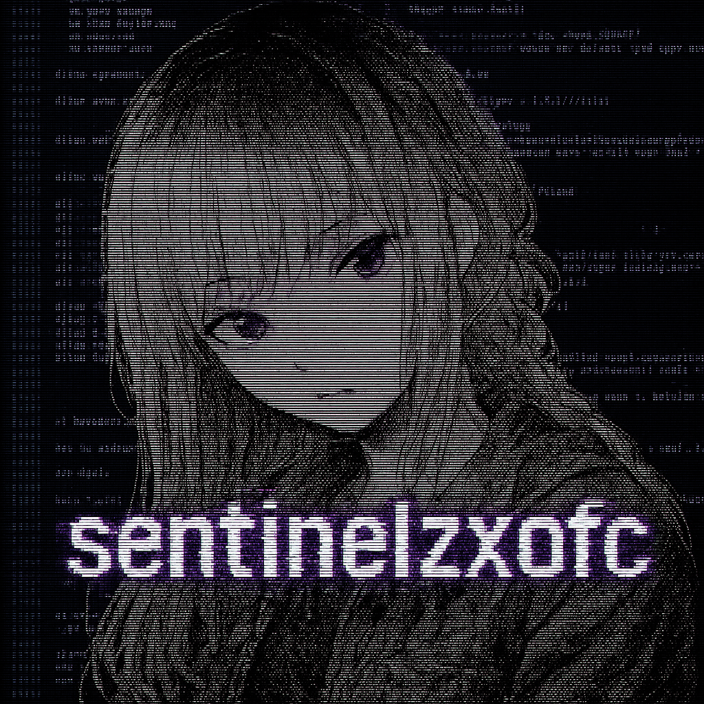

<div align="center">

  <!-- ASCII Art e Banner -->
  # </welcome to nowhere>

  

  <!-- Typing Animation -->
  

</div>

<div align="center">
  
</div>

<br>

<!-- Bio -->
<div align="center">

  ## 📖 **Bio**

  **Sempre estou por aí </>**

  > Quando tiver com inspiração coloco um texto, falo algo emocionante

  <!-- ASCII Art Original -->
```

⠀⠀⠀⠀⠀⠀⠀⠀⠀⠀⠀⠀⠀⠀⠀⠀⠀⠀⠀⠀⠀⠀⠀⠀⠀⠀⠀⠀⠀⠀⠀⠀⠀⠀⠀⠀⣀⡠⢤⡀⠀⠀⠀⠀⠀⠀⠀⠀⠀⠀
⠀⠀⠀⠀⠀⠀⠀⠀⠀⠀⠀⠀⠀⠀⠀⠀⠀⠀⠀⠀⠀⠀⠀⠀⠀⠀⠀⠀⠀⠀⠀⠀⢀⡴⠟⠃⠀⠀⠙⣄⠀⠀⠀⠀⠀⠀⠀⠀⠀
⠀⠀⠀⠀⠀⠀⠀⠀⠀⠀⠀⠀⠀⠀⠀⠀⠀⠀⠀⠀⠀⠀⠀⠀⠀⠀⠀⠀⠀⠀⠀⣠⠋⠀⠀⠀⠀⠀⠀⠘⣆⠀⠀⠀⠀⠀⠀⠀⠀
⠀⠀⠀⠀⠀⠀⠀⠀⠀⠀⠀⠀⠀⠀⠀⠀⠀⠀⠀⠀⠀⠀⠀⠀⠀⠀⠀⠀⠀⢠⠾⢛⠒⠀⠀⠀⠀⠀⠀⠀⢸⡆⠀⠀⠀⠀⠀⠀⠀
⠀⠀⠀⠀⠀⠀⠀⠀⠀⠀⠀⠀⠀⠀⠀⠀⠀⠀⠀⠀⠀⠀⠀⠀⠀⠀⠀⠀⠀⣿⣶⣄⡈⠓⢄⠠⡀⠀⠀⠀⣄⣷⠀⠀⠀⠀⠀⠀⠀
⠀⠀⠀⠀⠀⠀⠀⠀⠀⠀⠀⠀⠀⠀⠀⠀⠀⠀⠀⠀⠀⠀⠀⠀⠀⠀⠀⠀⢀⣿⣷⠀⠈⠱⡄⠑⣌⠆⠀⠀⡜⢻⠀⠀⠀⠀⠀⠀⠀
⠀⠀⠀⠀⠀⠀⠀⠀⠀⠀⠀⠀⠀⠀⠀⠀⠀⠀⠀⠀⠀⠀⠀⠀⠀⠀⠀⠀⢸⣿⡿⠳⡆⠐⢿⣆⠈⢿⠀⠀⡇⠘⡆⠀⠀⠀⠀⠀⠀
⠀⠀⠀⠀⠀⠀⠀⠀⠀⠀⠀⠀⠀⠀⠀⠀⠀⠀⠀⠀⠀⠀⠀⠀⠀⠀⠀⠀⠀⢿⣿⣷⡇⠀⠀⠈⢆⠈⠆⢸⠀⠀⢣⠀⠀⠀⠀⠀⠀
⠀⠀⠀⠀⠀⠀⠀⠀⠀⠀⠀⠀⠀⠀⠀⠀⠀⠀⠀⠀⠀⠀⠀⠀⠀⠀⠀⠀⠀⠘⣿⣿⣿⣧⠀⠀⠈⢂⠀⡇⠀⠀⢨⠓⣄⠀⠀⠀⠀
⠀⠀⠀⠀⠀⠀⠀⠀⠀⠀⠀⠀⠀⠀⠀⠀⠀⠀⠀⠀⠀⠀⠀⠀⠀⠀⠀⠀⠀⠀⣸⣿⣿⣿⣦⣤⠖⡏⡸⠀⣀⡴⠋⠀⠈⠢⡀⠀⠀
⠀⠀⠀⠀⠀⠀⠀⠀⠀⠀⠀⠀⠀⠀⠀⠀⠀⠀⠀⠀⠀⠀⠀⠀⠀⠀⠀⠀⢠⣾⠁⣹⣿⣿⣿⣷⣾⠽⠖⠊⢹⣀⠄⠀⠀⠀⠈⢣⡀
⠀⠀⠀⠀⠀⠀⠀⠀⠀⠀⠀⠀⠀⠀⠀⠀⠀⠀⠀⠀⠀⠀⠀⠀⠀⠀⠀⠀⡟⣇⣰⢫⢻⢉⠉⠀⣿⡆⠀⠀⡸⡏⠀⠀⠀⠀⠀⠀⢇
⠀⠀⠀⠀⠀⠀⠀⠀⠀⠀⠀⠀⠀⠀⠀⠀⠀⠀⠀⠀⠀⠀⠀⠀⠀⠀⠀⢨⡇⡇⠈⢸⢸⢸⠀⠀⡇⡇⠀⠀⠁⠻⡄⡠⠂⠀⠀⠀⠘
⢤⣄⠀⠀⠀⠀⠀⠀⠀⠀⠀⠀⠀⠀⠀⠀⠀⠀⠀⠀⠀⠀⠀⠀⠀⠀⠀⢠⠛⠓⡇⠀⠸⡆⢸⠀⢠⣿⠀⠀⠀⠀⣰⣿⣵⡆⠀⠀⠀⠀
⠈⢻⣷⣦⣀⠀⠀⠀⠀⠀⠀⠀⠀⠀⠀⠀⠀⠀⠀⠀⠀⠀⠀⠀⠀⠀⣠⡿⣦⣀⡇⠀⢧⡇⠀⠀⢺⡟⠀⠀⠀⢰⠉⣰⠟⠊⣠⠂⠀⡸
⠀⠀⢻⣿⣿⣷⣦⣀⠀⠀⠀⠀⠀⠀⠀⠀⠀⠀⠀⠀⠀⠀⠀⠀⠀⣠⢧⡙⠺⠿⡇⠀⠘⠇⠀⠀⢸⣧⠀⠀⢠⠃⣾⣌⠉⠩⠭⠍⣉⡇
⠀⠀⠀⠻⣿⣿⣿⣿⣿⣦⣀⠀⠀⠀⠀⠀⠀⠀⠀⠀⠀⠀⠀⣠⣞⣋⠀⠈⠀⡳⣧⠀⠀⠀⠀⠀⢸⡏⠀⠀⡞⢰⠉⠉⠉⠉⠉⠓⢻⠃
⠀⠀⠀⠀⠹⣿⣿⣿⣿⣿⣿⣷⡄⠀⠀⢀⣀⠠⠤⣤⣤⠤⠞⠓⢠⠈⡆⠀⢣⣸⣾⠆⠀⠀⠀⠀⠀⢀⣀⢸⣀⣿⣿⣿⣶⣶⣶⣶⣿⡀
⠀⠀⠀⠀⠀⠘⢿⣿⣿⣿⣿⣿⣿⣄⠀⠀⠀⠀⠀⠀⠀⠀⠀⠀⠀⠀⠀⠀⠀⠀⠀⠀⠀⠀⠀⠀⠀⠀⢸⣿⣿⣿⣿⣿⣿⣿⣿⣿⣿⡇
⠀⠀⠀⠀⠀⠀⠀⠻⣿⣿⣿⣿⣿⣿⣷⣄⠀⠀⠀⠀⠀⠀⠀⠀⠀⠀⠀⠀⠀⠀⠀⠀⠀⠀⠀⠀⠀⣠⣾⣿⣿⣿⣿⣿⣿⣿⣿⣿⣿⡇
⠀⠀⠀⠀⠀⠀⠀⠀⠙⢿⣿⣿⣿⣿⣿⣿⣷⡀⠀⠀⠀⠀⠀⠀⠀⠀⠀⠀⠀⠀⠀⠀⠀⠀⠀⣠⣾⣿⣿⣿⣿⣿⣿⣿⣿⣿⣿⣿⡿⠃
⠀⠀⠀⠀⠀⠀⠀⠀⠀⠀⠙⢿⣿⣿⣿⣿⣿⣿⣷⣦⣄⡀⠀⠀⠀⠀⠀⠀⠀⠀⠀⠀⢀⣠⣾⣿⣿⣿⣿⣿⣿⣿⣿⣿⣿⣿⣿⡿⠋⠀⠀
⠀⠀⠀⠀⠀⠀⠀⠀⠀⠀⠀⠀⠈⠛⢿⣿⣿⣿⣿⣿⣿⣿⣿⣷⣶⣶⣶⣶⣶⣶⣶⣾⣿⣿⣿⣿⣿⣿⣿⣿⣿⣿⣿⡿⠟⠉⠀⠀⠀⠀
⠀⠀⠀⠀⠀⠀⠀⠀⠀⠀⠀⠀⠀⠀⠀⠈⠙⠻⢿⣿⣿⣿⣿⣿⣿⣿⣿⣿⣿⣿⣿⣿⣿⣿⣿⣿⣿⣿⠿⠛⠋⠁⠀⠀⠀⠀⠀⠀⠀⠀
⠀⠀⠀⠀⠀⠀⠀⠀⠀⠀⠀⠀⠀⠀⠀⠀⠀⠀⠀⠉⠙⠛⠻⠿⠿⠿⠿⠿⠿⠿⠟⠛⠛⠋⠉⠁⠀⠀⠀⠀⠀⠀⠀⠀⠀⠀⠀⠀⠀

```

</div>

<br><br>

<!-- Stack Tecnológica - NOVA SEÇÃO QUE VOCÊ GOSTOU -->
<div align="center">

  ## 💻 **Stack Tecnológica**

  ### **Linguagens & Frameworks**
  <br>
  
  <table>
    <tr>
      <td align="center">
        
        <br>
        <sub><b>Frontend & JavaScript</b></sub>
      </td>
      <td align="center">
        
        <br>
        <sub><b>Backend Python</b></sub>
      </td>
    </tr>
    <tr>
      <td align="center">
        
        <br>
        <sub><b>Web Design</b></sub>
      </td>
      <td align="center">
        
        <br>
        <sub><b>Backend & Databases</b></sub>
      </td>
    </tr>
  </table>

  <br>
  
  ### **Ferramentas & Plataformas**
  <br>
  
  <div align="center">
    
  </div>

</div>

<br><br>

<!-- Botão Principal do Site -->
<div align="center">

  ## 🌐 **Portfólio Principal**

  <a href="https://sentinelzxofc.github.io/sentinelzxofc/" target="_blank">
    
  </a>

  <br><br>
  
  <sub><em>Clique acima para ver meus projetos e trabalhos mais recentes</em></sub>

</div>

<br><br>

<!-- Tecnologias & Ferramentas (Mantendo seu estilo original) -->
<div align="center">

  ## 🛠️ **Tecnologias & Ferramentas**

  
  
  
  
  
  
  
  

</div>

<br><br>
