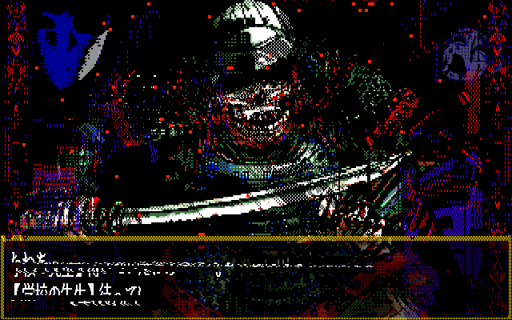

# </welcome to nowhere>

<div align="center">
  
  

  

</div>

<div align="center">
  
</div>

## 📖 Bio 

**Sempre estou por aí </>**

> Quando tiver inspiração coloco um texto, falo algo emocionante

<div align="center">
  
```
⠀⠀⠀⠀⠀⠀⠀⠀⠀⠀⠀⠀⠀⠀⠀⠀⠀⠀⠀⠀⠀⠀⠀⠀⠀⠀⠀⠀⠀⠀⠀⠀⠀⠀⠀⠀⣀⡠⢤⡀⠀⠀⠀⠀⠀⠀⠀⠀⠀⠀
⠀⠀⠀⠀⠀⠀⠀⠀⠀⠀⠀⠀⠀⠀⠀⠀⠀⠀⠀⠀⠀⠀⠀⠀⠀⠀⠀⠀⠀⠀⠀⠀⠀⢀⡴⠟⠃⠀⠀⠙⣄⠀⠀⠀⠀⠀⠀⠀⠀⠀
⠀⠀⠀⠀⠀⠀⠀⠀⠀⠀⠀⠀⠀⠀⠀⠀⠀⠀⠀⠀⠀⠀⠀⠀⠀⠀⠀⠀⠀⠀⠀⠀⣠⠋⠀⠀⠀⠀⠀⠀⠘⣆⠀⠀⠀⠀⠀⠀⠀⠀
⠀⠀⠀⠀⠀⠀⠀⠀⠀⠀⠀⠀⠀⠀⠀⠀⠀⠀⠀⠀⠀⠀⠀⠀⠀⠀⠀⠀⠀⠀⢠⠾⢛⠒⠀⠀⠀⠀⠀⠀⠀⢸⡆⠀⠀⠀⠀⠀⠀⠀
⠀⠀⠀⠀⠀⠀⠀⠀⠀⠀⠀⠀⠀⠀⠀⠀⠀⠀⠀⠀⠀⠀⠀⠀⠀⠀⠀⠀⠀⠀⣿⣶⣄⡈⠓⢄⠠⡀⠀⠀⠀⣄⣷⠀⠀⠀⠀⠀⠀⠀
⠀⠀⠀⠀⠀⠀⠀⠀⠀⠀⠀⠀⠀⠀⠀⠀⠀⠀⠀⠀⠀⠀⠀⠀⠀⠀⠀⠀⠀⢀⣿⣷⠀⠈⠱⡄⠑⣌⠆⠀⠀⡜⢻⠀⠀⠀⠀⠀⠀⠀
⠀⠀⠀⠀⠀⠀⠀⠀⠀⠀⠀⠀⠀⠀⠀⠀⠀⠀⠀⠀⠀⠀⠀⠀⠀⠀⠀⠀⠀⢸⣿⡿⠳⡆⠐⢿⣆⠈⢿⠀⠀⡇⠘⡆⠀⠀⠀⠀⠀⠀
⠀⠀⠀⠀⠀⠀⠀⠀⠀⠀⠀⠀⠀⠀⠀⠀⠀⠀⠀⠀⠀⠀⠀⠀⠀⠀⠀⠀⠀⠀⢿⣿⣷⡇⠀⠀⠈⢆⠈⠆⢸⠀⠀⢣⠀⠀⠀⠀⠀⠀
⠀⠀⠀⠀⠀⠀⠀⠀⠀⠀⠀⠀⠀⠀⠀⠀⠀⠀⠀⠀⠀⠀⠀⠀⠀⠀⠀⠀⠀⠀⠘⣿⣿⣿⣧⠀⠀⠈⢂⠀⡇⠀⠀⢨⠓⣄⠀⠀⠀⠀
⠀⠀⠀⠀⠀⠀⠀⠀⠀⠀⠀⠀⠀⠀⠀⠀⠀⠀⠀⠀⠀⠀⠀⠀⠀⠀⠀⠀⠀⠀⠀⣸⣿⣿⣿⣦⣤⠖⡏⡸⠀⣀⡴⠋⠀⠈⠢⡀⠀⠀
⠀⠀⠀⠀⠀⠀⠀⠀⠀⠀⠀⠀⠀⠀⠀⠀⠀⠀⠀⠀⠀⠀⠀⠀⠀⠀⠀⠀⠀⢠⣾⠁⣹⣿⣿⣿⣷⣾⠽⠖⠊⢹⣀⠄⠀⠀⠀⠈⢣⡀
⠀⠀⠀⠀⠀⠀⠀⠀⠀⠀⠀⠀⠀⠀⠀⠀⠀⠀⠀⠀⠀⠀⠀⠀⠀⠀⠀⠀⠀⡟⣇⣰⢫⢻⢉⠉⠀⣿⡆⠀⠀⡸⡏⠀⠀⠀⠀⠀⠀⢇
⠀⠀⠀⠀⠀⠀⠀⠀⠀⠀⠀⠀⠀⠀⠀⠀⠀⠀⠀⠀⠀⠀⠀⠀⠀⠀⠀⠀⢨⡇⡇⠈⢸⢸⢸⠀⠀⡇⡇⠀⠀⠁⠻⡄⡠⠂⠀⠀⠀⠘
⢤⣄⠀⠀⠀⠀⠀⠀⠀⠀⠀⠀⠀⠀⠀⠀⠀⠀⠀⠀⠀⠀⠀⠀⠀⠀⠀⢠⠛⠓⡇⠀⠸⡆⢸⠀⢠⣿⠀⠀⠀⠀⣰⣿⣵⡆⠀⠀⠀⠀
⠈⢻⣷⣦⣀⠀⠀⠀⠀⠀⠀⠀⠀⠀⠀⠀⠀⠀⠀⠀⠀⠀⠀⠀⠀⠀⣠⡿⣦⣀⡇⠀⢧⡇⠀⠀⢺⡟⠀⠀⠀⢰⠉⣰⠟⠊⣠⠂⠀⡸
⠀⠀⢻⣿⣿⣷⣦⣀⠀⠀⠀⠀⠀⠀⠀⠀⠀⠀⠀⠀⠀⠀⠀⠀⠀⣠⢧⡙⠺⠿⡇⠀⠘⠇⠀⠀⢸⣧⠀⠀⢠⠃⣾⣌⠉⠩⠭⠍⣉⡇
⠀⠀⠀⠻⣿⣿⣿⣿⣿⣦⣀⠀⠀⠀⠀⠀⠀⠀⠀⠀⠀⠀⠀⣠⣞⣋⠀⠈⠀⡳⣧⠀⠀⠀⠀⠀⢸⡏⠀⠀⡞⢰⠉⠉⠉⠉⠉⠓⢻⠃
⠀⠀⠀⠀⠹⣿⣿⣿⣿⣿⣿⣷⡄⠀⠀⢀⣀⠠⠤⣤⣤⠤⠞⠓⢠⠈⡆⠀⢣⣸⣾⠆⠀⠀⠀⠀⠀⢀⣀⢸⣀⣿⣿⣿⣶⣶⣶⣶⣿⡀
⠀⠀⠀⠀⠀⠘⢿⣿⣿⣿⣿⣿⣿⣄⠀⠀⠀⠀⠀⠀⠀⠀⠀⠀⠀⠀⠀⠀⠀⠀⠀⠀⠀⠀⠀⠀⠀⠀⢸⣿⣿⣿⣿⣿⣿⣿⣿⣿⣿⡇
⠀⠀⠀⠀⠀⠀⠀⠻⣿⣿⣿⣿⣿⣿⣷⣄⠀⠀⠀⠀⠀⠀⠀⠀⠀⠀⠀⠀⠀⠀⠀⠀⠀⠀⠀⠀⠀⣠⣾⣿⣿⣿⣿⣿⣿⣿⣿⣿⣿⡇
⠀⠀⠀⠀⠀⠀⠀⠀⠙⢿⣿⣿⣿⣿⣿⣿⣷⡀⠀⠀⠀⠀⠀⠀⠀⠀⠀⠀⠀⠀⠀⠀⠀⠀⠀⣠⣾⣿⣿⣿⣿⣿⣿⣿⣿⣿⣿⣿⡿⠃
⠀⠀⠀⠀⠀⠀⠀⠀⠀⠀⠙⢿⣿⣿⣿⣿⣿⣿⣷⣦⣄⡀⠀⠀⠀⠀⠀⠀⠀⠀⠀⠀⢀⣠⣾⣿⣿⣿⣿⣿⣿⣿⣿⣿⣿⣿⡿⠋⠀⠀
⠀⠀⠀⠀⠀⠀⠀⠀⠀⠀⠀⠀⠈⠛⢿⣿⣿⣿⣿⣿⣿⣿⣿⣷⣶⣶⣶⣶⣶⣶⣶⣾⣿⣿⣿⣿⣿⣿⣿⣿⣿⣿⣿⡿⠟⠉⠀⠀⠀⠀
⠀⠀⠀⠀⠀⠀⠀⠀⠀⠀⠀⠀⠀⠀⠀⠈⠙⠻⢿⣿⣿⣿⣿⣿⣿⣿⣿⣿⣿⣿⣿⣿⣿⣿⣿⣿⣿⣿⣿⠿⠛⠋⠁⠀⠀⠀⠀⠀⠀⠀
⠀⠀⠀⠀⠀⠀⠀⠀⠀⠀⠀⠀⠀⠀⠀⠀⠀⠀⠀⠀⠉⠙⠛⠻⠿⠿⠿⠿⠿⠿⠿⠟⠛⠛⠋⠉⠁⠀⠀⠀⠀⠀⠀⠀⠀⠀⠀⠀⠀⠀
```

</div>

## 🛠️ Tecnologias & Ferramentas

<div align="center">
  
  
  
  
  
  
  

</div>

## 📊 Estatísticas do GitHub

<div align="center">
  
  
</div>

<div align="center">
  
</div>

## 🏆 Troféus GitHub

<div align="center">
  
</div>

## 🌐 Portfólio & Projetos

<div align="center">
  
  [](https://sentinelzxofc.github.io/sentinelzxofc/)
  [](https://github.com/sentinelzxofc)

</div>

## ⚫️ Contato  

<div align="center">
  
  <a href="mailto:daniel777vitorzx@gmail.com">
    
  </a>
  <a href="https://instagram.com/sentinelzxofc">
    
  </a>
  
</div>

---

<div align="center">
  
  
  ### Visitantes
  
  

</div>
